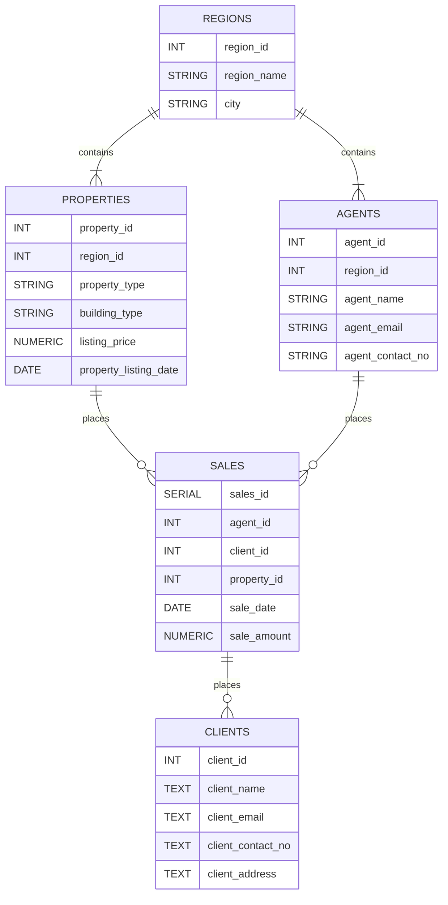

# Real Estate Analytics (RE Analytics) ~ SQL Project


    

TOC: 
- [Real Estate Analytics (RE Analytics) ~ SQL Project](#real-estate-analytics-re-analytics--sql-project)
  - [Project Overview](#project-overview)
  - [Database diagram](#database-diagram)
    - [regions](#regions)
    - [agents](#agents)
    - [properties](#properties)
    - [clients](#clients)
    - [sales](#sales)
  - [Entity Relationships](#entity-relationships)
  - [Analytics queries](#analytics-queries)
  - [Project structure](#project-structure)
  - [How to run this project](#how-to-run-this-project)
  - [Skills Demonstrated](#skills-demonstrated)


## Project Overview
This PostgreSQL database simulates a real estate database and makes use of SQL to analyze sales performance, property inventory, and agent performance metrics.

The dataset models a real-estate business with information on:
- Regions
- Agents
- Properties
- Clients
- Property sales

The main goal of this project is to answer common business questions related to revenue, property sales, and agent performance using SQL queries.


## Database diagram



The database contains five tables:

### regions
Stores the Philippines administrative regions in where properties are located.

### agents 
Represents the real estate agents within the real estate company. They are responsible for selling the properties.

### properties
Contains all information about the property inventory, including: listings, types, listing price, and listing date.

### clients
Stores information about clients who purchased/are going to purchase properties.

### sales
Represents completed sales, linking agents, clients, and properties together

## Entity Relationships
- A **region** can have multiple properties and agents.
- A **property** belongs to only one region
- An **agent** belongs to one region
- A **sale** connects to a property, an agent, and a client
- A **client** can purchase multiple properties

## Analytics queries

The SQL queries answer key business questions such as:

- What is the total revenue generated from property sales?
- Which agents generate the most revenue for the agency?
- Which region produces the highest total sales value?
- How many properties have been sold versus remain unsold?
- What is the average sale price for each property type?
- Which agent has sold the most properties?
- How long does it take on average for a property to sell?
- Which property types generate the most total revenue?
- Which agents close the highest average-value deals?
- What are the monthly sales trends for the agency?

## Project structure
```txt
re_agency_schema/
├── re_agency_schema.sql -> Contains the real estate database schema
├── re_analytics.sql -> Contains the SQL queries that answer business questions
├── re_dataset.sql -> Contains the data which populates the real estate table
└── README.md
```

## How to run this project

1. Create the database and table
```sql
psql -d postgres (insert any postgres database) -f re_agency_schema.sql
```

2. Insert sample dataset 
```sql
psql -d re_agency_db -f re_dataset.sql
```
3. Run analytics queries
```sql
psql -d re_agency_db -f re_analytics.sql
```

## Skills Demonstrated

- Relational database design
- Table relationships and foreign keys
- SQL JOIN operations
- Aggregations (SUM, AVG, COUNT)
- Conditional aggregation using CASE
- Date analysis and time calculations
- Translating business questions into SQL queries
- Data analysis using SQL