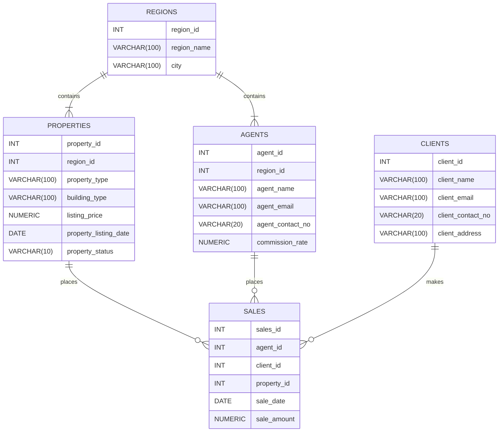

# Real Estate Analytics (RE Analytics) ~ SQL Project


    

TOC: 
- [Real Estate Analytics (RE Analytics) ~ SQL Project](#real-estate-analytics-re-analytics--sql-project)
  - [Project Overview](#project-overview)
  - [Database diagram](#database-diagram)
    - [regions](#regions)
    - [agents](#agents)
    - [properties](#properties)
    - [clients](#clients)
    - [sales](#sales)
  - [Entity Relationships](#entity-relationships)
  - [Analytics queries](#analytics-queries)
    - [Revenue Health](#revenue-health)
    - [Agent Performance](#agent-performance)
    - [Property Performance](#property-performance)
    - [Client Insights](#client-insights)
  - [Project structure](#project-structure)
  - [How to run this project](#how-to-run-this-project)
  - [Key Metrics](#key-metrics)
  - [Key Insights](#key-insights)
  - [Skills Demonstrated](#skills-demonstrated)


## Project Overview

This PostgreSQL database simulates a real estate database and makes use of SQL to analyze sales performance, property inventory, and agent performance metrics.

The dataset models a real-estate business with information on:
- Regions
- Agents
- Properties
- Clients
- Property sales

The main goal of this project is to answer common business questions related to revenue, property sales, and agent performance using SQL queries.


## Database diagram



The database contains five tables:

### regions
Stores the Philippines administrative regions in where properties are located.

### agents 
Represents the real estate agents within the real estate company. They are responsible for selling the properties.

### properties
Contains all information about the property inventory, including: listings, types, listing price, and listing date.

### clients
Stores information about clients who purchased/are going to purchase properties.

### sales
Represents completed sales, linking agents, clients, and properties together

## Entity Relationships

- A **region** can have multiple properties and agents.
- A **property** belongs to only one region
- An **agent** belongs to one region
- A **sale** connects to a property, an agent, and a client
- A **client** can purchase multiple properties

## Analytics queries

### Revenue Health

1. What is the total revenue generated by the agency?
Purpose: Measures the overall sales performance of the real estate agency.
Metric used: 
```
SUM(sale_amount)
```

2. Which regions generate the most revenue?
Purpose: Identifies the geographic areas which contribute the most to agency revenue.
Metric used:
```
SUM(sale_amount) by region
```

3. How does monthly revenue change over time? 
Purpose: Analyzes whether the agency’s revenue is increasing or decreasing over time. (over a monthly period)
Metric used:
```
Month by month revenue growth
```

4. What is the total running revenue of the business?
Purpose: To check if the business can hit its financial goals within the year
Metric used:
```
Running total of revenue overtime using cumulative aggregation
```

### Agent Performance
5. Which agents generate the most revenue?
Purpose: Identifies the top performing agents based on total sales generated
Metric used:
```
Total sum of all agents sales
```

6. How do agents rank against each other (based on their total sales)?
Purpose: Ranks agents by revenue to evaluate performance across all agents
Metric used:
```
RANK() by total agent sales
```

7. Which agents close the highest-value deals on average?
Purpose: Determines the agents who typically handle higher-value property transactions.
Metric used:
```
Average sale amount per agent
```

8. How do agents perform compared to the regional average?
Purpose: Determine the performance of an agent compared to the sale average per region

```
AVG(sale_amount) per agent and per region
```

9. How much commissions do agents earn per sale?
Purpose: Checks how much commissions an agent receives each time they make a sale

```
(sale_amount * commission_rate) / 100 per agent
```

### Property Performance
10. Which property types sell for the highest prices on average?
Purpose: Identifies which property categories have the highest market prices.
Metric used:
```
AVG(listing_price) per property_type
```

11. How long does it take for a property to sell on average?
Purpose: Measures the average time properties stay on the market before being sold.
Metric used:
```
sale_date - listing_date
```

12. How many properties are sold vs unsold?
Purpose: Takes note of property sold vs unsold.
Metric used:
```
Sold properties
Unsold properties
```

13. What is the percentage of sold properties per region?
Purpose: Analyze the conversion rates of properties per region
Metric used:
```
COUNT(sold_properties) / COUNT(all_properties) 
```

### Client Insights
14. Which clients have spent the most on property purchases?
Purpose: Identifies high value customers based on total property purchase amounts.
Metric used:
```
SUM(sale_amount) per client
```

## Project structure
```txt
re_agency_schema/
├── re_agency_schema.sql -> Contains the real estate database schema
├── re_analytics.sql -> Contains the SQL queries that answer business questions
├── re_dataset.sql -> Contains the data which populates the real estate table
└── README.md
```

## How to run this project

1. Create the database and table
```sql
psql -d postgres (insert any postgres database) -f re_agency_schema.sql
```

2. Insert sample dataset 
```sql
psql -d re_agency_db -f re_dataset.sql
```
3. Run analytics queries
```sql
psql -d re_agency_db -f re_analytics.sql
```

## Key Metrics

- Total Revenue
- Revenue by Region
- Monthly Revenue Trend
- Average Days on Market
- Agent Performance (Total & Average Sales)
- Property Conversion Rate

## Key Insights

- NCR generates the highest revenue, significantly outperforming other regions. This suggests strong demand and higher property values in the area which makes it a priority for premium listings and further investment for the business.
- Properties have an average of 74 days to sell which indicates slow turnover for the agency. This may suggest that current pricing is inefficient or low property demand. The business can explore by adjusting pricing strategies or improving marketing efforts to reduce time on the market. 
- Monthly revenue shows fluctuations, averaging ₱32.5M. However, it lacks a consistent upward trend. This instability may indicate seasonal demand or inconsistent sales. This suggests a need for more stable lead generation, sales strategies or improving on marketing.
-  Region II generates the lowest revenue amongst all regions, showing underperformance. This shows that there are opportunities to increase marketing efforts, improving property offers, or reassessing pricing strategies to boost sales within the area.
- The top-performing agents (by average sales value) are concentrated in NCR, suggesting that agent skills & expertise may be a key driver of the region's success. Applying their strategies or mentorship to underperforming regions could help improve overall performance.

## Skills Demonstrated

- Relational database design
- Table relationships and foreign keys
- SQL JOIN operations
- Aggregations (SUM, AVG, COUNT)
- Conditional aggregation using CASE
- Date analysis and time calculations
- Translating business questions into SQL queries
- Data analysis using SQL