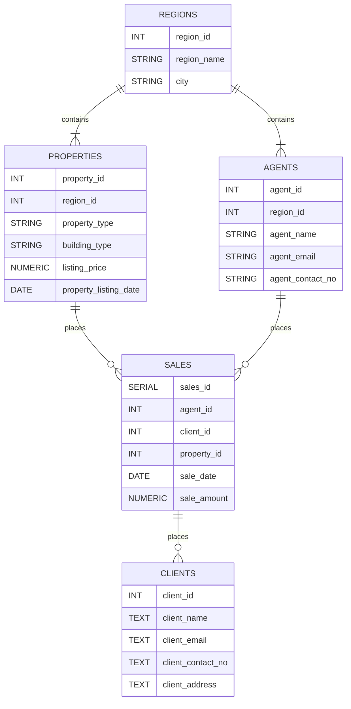

# Real Estate Analytics (RE Analytics) ~ SQL Project


    

TOC: 
- [Real Estate Analytics (RE Analytics) ~ SQL Project](#real-estate-analytics-re-analytics--sql-project)
  - [Project Overview](#project-overview)
  - [Database diagram](#database-diagram)
    - [regions](#regions)
    - [agents](#agents)
    - [properties](#properties)
    - [clients](#clients)
    - [sales](#sales)
  - [Entity Relationships](#entity-relationships)
  - [Analytics queries](#analytics-queries)
    - [Revenue Health](#revenue-health)
    - [Agent Performance](#agent-performance)
    - [Property Performance](#property-performance)
    - [Client Insights](#client-insights)
  - [Project structure](#project-structure)
  - [How to run this project](#how-to-run-this-project)
  - [Skills Demonstrated](#skills-demonstrated)


## Project Overview
This PostgreSQL database simulates a real estate database and makes use of SQL to analyze sales performance, property inventory, and agent performance metrics.

The dataset models a real-estate business with information on:
- Regions
- Agents
- Properties
- Clients
- Property sales

The main goal of this project is to answer common business questions related to revenue, property sales, and agent performance using SQL queries.


## Database diagram



The database contains five tables:

### regions
Stores the Philippines administrative regions in where properties are located.

### agents 
Represents the real estate agents within the real estate company. They are responsible for selling the properties.

### properties
Contains all information about the property inventory, including: listings, types, listing price, and listing date.

### clients
Stores information about clients who purchased/are going to purchase properties.

### sales
Represents completed sales, linking agents, clients, and properties together

## Entity Relationships
- A **region** can have multiple properties and agents.
- A **property** belongs to only one region
- An **agent** belongs to one region
- A **sale** connects to a property, an agent, and a client
- A **client** can purchase multiple properties

## Analytics queries

### Revenue Health

1. What is the total revenue generated by the agency?
Purpose: Measures the overall sales performance of the real estate agency.
Metric used: 
```
SUM(sale_amount)
```

2. Which regions generate the most revenue?
Purpose: Identifies the geographic areas which contribute the most to agency revenue.
Metric used:
```
SUM(sale_amount) by region
```

3. How is the monthly revenue for the agency?
Purpose: Analyzes whether the agency’s revenue is increasing or decreasing over time. (over a monthly period)
Metric used:
```
Month by month revenue growth
```

### Agent Performance
4. Which agents generate the most revenue?
Purpose: Identifies the top performing agents based on total sales generated
Metric used:
```
SUM(sale_amount) per agent
```

5. How do agents rank against each other (based on their total sales)?
Purpose: Ranks agents by revenue to evaluate performance across all agents
Metric used:
```
RANK() by total sales
```

6. Which agents close the highest-value deals on average?
Purpose: Determines the agents who typically handle higher-value property transactions.
Metric used:
```
AVG(sale_amount) per agent
```

### Property Performance
7. Which property types sell for the highest prices on average?
Purpose: Identifies which property categories have the highest market prices.
Metric used:
```
AVG(listing_price) per property_type
```

8. How long does it take for a property to sell on average?
Purpose: Measures the average time properties stay on the market before being sold.
Metric used:
```
sale_date - listing_date
```

9. How many propeties are sold vs unsold?
Purpose: Takes note of property sold vs unsold.
Metric used:
```
Sold properties
Unsold properties
```

### Client Insights
10. Which clients have spent the most on property purchases?
Purpose: Identifies high value customers based on total property purchase amounts.
Metric used:
```
SUM(sale_amount) per client
```

## Project structure
```txt
re_agency_schema/
├── re_agency_schema.sql -> Contains the real estate database schema
├── re_analytics.sql -> Contains the SQL queries that answer business questions
├── re_dataset.sql -> Contains the data which populates the real estate table
└── README.md
```

## How to run this project

1. Create the database and table
```sql
psql -d postgres (insert any postgres database) -f re_agency_schema.sql
```

2. Insert sample dataset 
```sql
psql -d re_agency_db -f re_dataset.sql
```
3. Run analytics queries
```sql
psql -d re_agency_db -f re_analytics.sql
```

## Skills Demonstrated

- Relational database design
- Table relationships and foreign keys
- SQL JOIN operations
- Aggregations (SUM, AVG, COUNT)
- Conditional aggregation using CASE
- Date analysis and time calculations
- Translating business questions into SQL queries
- Data analysis using SQL